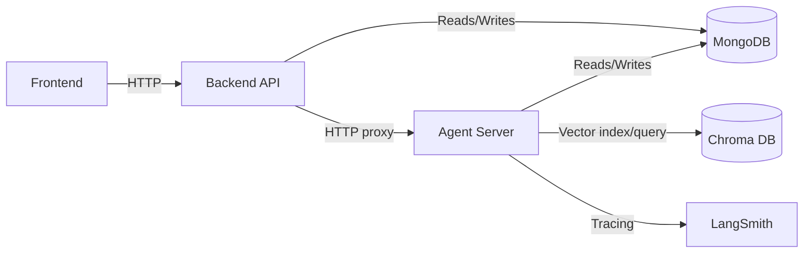
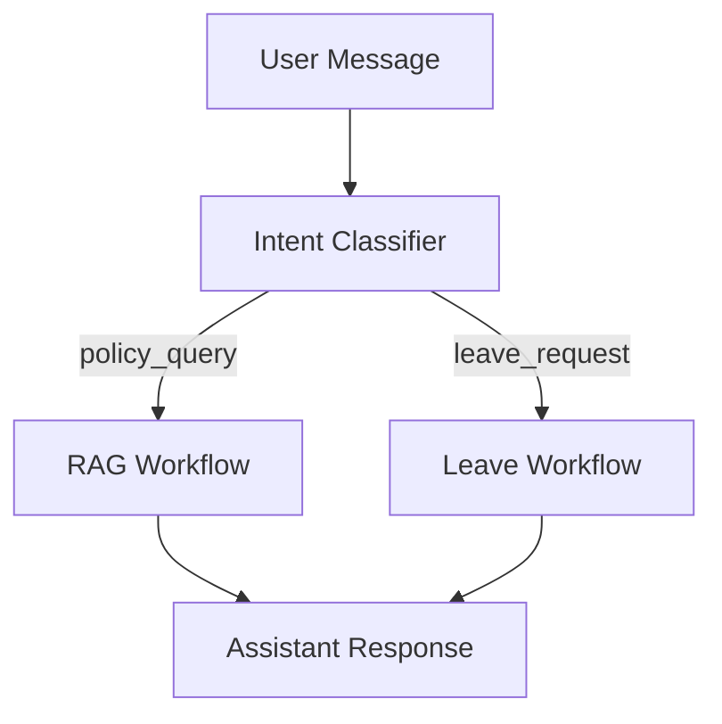
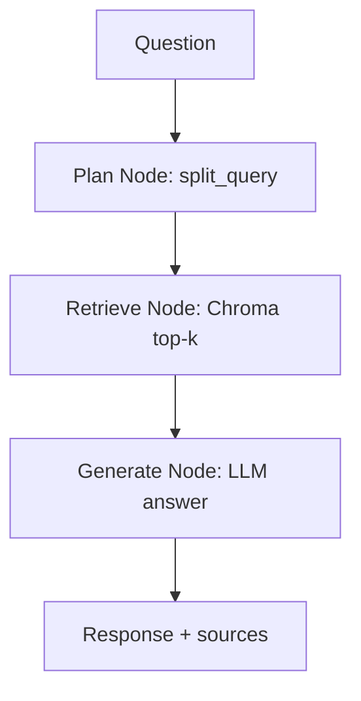
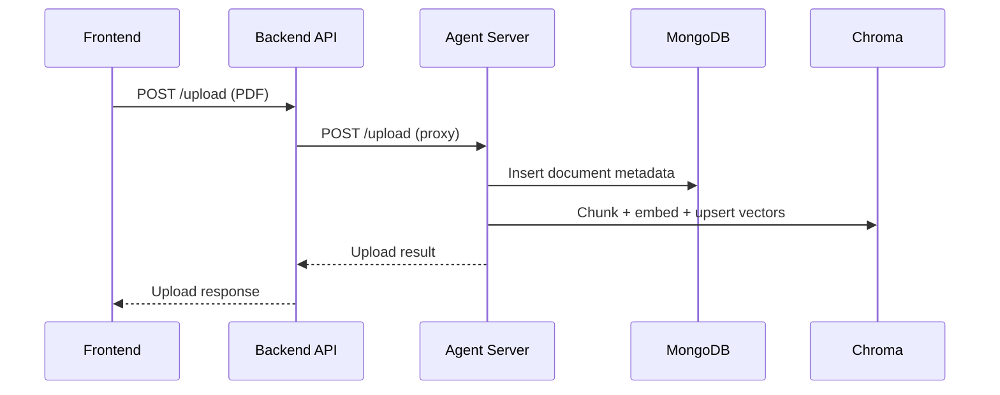
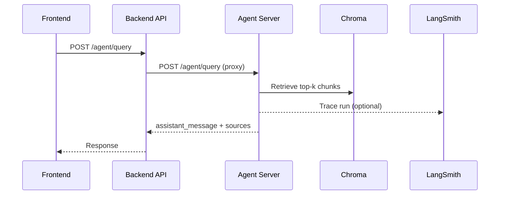
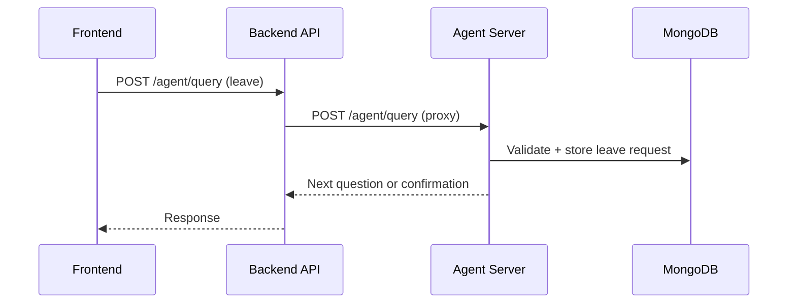

# LegalMind Architecture

## Components

- Frontend (Vite + React): UI for chat, documents, and admin workflows.
- Backend (FastAPI): Auth, company context, document metadata, and proxy to agent server.
- Agent Server (FastAPI + LangGraph): Intent routing, RAG retrieval, leave workflow, and vector indexing.
- MongoDB: Stores users, companies, documents metadata, leave requests, and chat history (shared by backend and agent).
- Chroma (persisted): Vector store for document chunks.
- LangSmith (optional): Tracing for agent RAG and workflow runs.

## High-Level Diagram

## LangGraph Agent Details

- Intent classifier uses Groq LLM with a heuristic fallback.
- RAG workflow nodes: plan (split query), retrieve (Chroma similarity), generate (Groq answer).
- RAG stores chat history and source metadata in MongoDB.
- Leave workflow: extract required fields, validate, store requests in MongoDB, return next question or confirmation.
- Tools and services:
  - `rag_service`: ingestion and retrieval (Chroma + HuggingFace embeddings)
  - `leave_service`: leave request validation and storage

## Main Flows

### 1) Document Upload and Indexing

1. User uploads PDF from the UI.
2. Backend receives `/upload` and proxies to agent server `/upload`.
3. Agent server stores the PDF in `legalmind-agent/uploads/<company_id>`.
4. Agent server saves document metadata in MongoDB.
5. Agent server extracts text, chunks it, embeds with HuggingFace, and writes vectors to Chroma.

### 2) Policy Q&A (RAG)

1. User asks a policy question in the UI.
2. Backend forwards `/agent/query` to the agent server.
3. Agent server classifies intent and routes to RAG.
4. RAG pulls top-k chunks from Chroma, generates an answer via Groq.
5. Agent server returns `assistant_message` and source metadata to backend.
6. Backend returns the response to the UI.

### 3) Leave Request Workflow

1. User submits a leave request via chat.
2. Backend forwards `/agent/query` to the agent server.
3. Agent server classifies intent and routes to leave workflow.
4. Leave workflow validates required fields and stores the request in MongoDB.
5. Agent server returns next question or submission confirmation.

## Configuration Notes

- Backend talks to the agent server via `AGENT_SERVER_URL`.
- Agent server owns RAG and vector storage via `CHROMA_PERSIST_DIR`.
- LangSmith tracing is configured in the agent server env.
